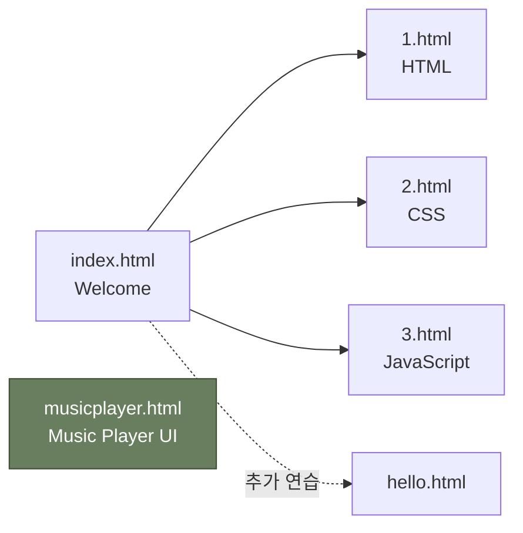

<div align="center">

[English](README.md) | 한국어

# koss_1

**HTML/CSS 입문 실습 — WEB1 튜토리얼 클론 & 뮤직 플레이어 UI**

<p>
  
  
  
  
</p>

웹 개발의 첫걸음으로 작성한 정적 HTML/CSS 페이지 모음입니다.
WEB1 스타일의 튜토리얼 페이지와 Flexbox 기반 뮤직 플레이어 UI 실습을 포함합니다.


</div>

---

## 개요

이 레포지토리는 **HTML과 CSS 기초**를 익히기 위한 실습 결과물입니다. 크게 두 가지 트랙으로 구성됩니다.

1. **WEB1 튜토리얼 클론** — `index.html`을 진입점으로 HTML / CSS / JavaScript 소개 페이지를 차례로 따라가며 만든 기본 마크업 연습.
2. **Music Player UI** — `musicplayer.html`에서 외부 CSS(`style.css`)와 Font Awesome 아이콘, Flexbox 레이아웃을 사용해 만든 정적 플레이어 UI.

> 어디까지나 마크업/스타일 학습용 결과물이며, 동적 동작이나 백엔드 로직은 포함되어 있지 않습니다.

---

## 페이지 구성

| 파일 | 페이지 제목 | 주제 | 비고 |
| :--- | :--- | :--- | :--- |
| [`index.html`](index.html) | WEB1 - Welcome | 진입점, 사이트 소개 | 메뉴(HTML/CSS/JS) 포함 |
| [`1.html`](1.html) | WEB1 - HTML | HTML 소개 | 기본 태그·이미지 삽입 |
| [`2.html`](2.html) | WEB1 - CSS | CSS 소개 | 내부 `<style>` 사용, `id`/`class` 셀렉터 |
| [`3.html`](3.html) | WEB1 - JavaScript | JavaScript 소개 | 마크업만 학습 단계 |
| [`hello.html`](hello.html) | WEB1 - html | HTML 페이지 사본 | 추가 연습용 |
| [`musicplayer.html`](musicplayer.html) | Music Player | Flexbox 기반 플레이어 UI | `style.css`, Font Awesome 사용 |

---

## 로컬에서 실행하기

별도 빌드 도구나 의존성 설치가 필요 없습니다. 정적 서버를 띄우면 됩니다.

```bash
# 레포 클론
git clone https://github.com/mrpc2003/koss_1.git
cd koss_1

# Python 내장 정적 서버 실행 (Python 3)
python3 -m http.server 8000
```

브라우저에서 다음 주소로 접속합니다.

```
http://localhost:8000/index.html
http://localhost:8000/musicplayer.html
```

> 파일을 직접 더블클릭해서 열어도 동작하지만, 일부 브라우저의 보안 정책상 외부 폰트·아이콘이 정상적으로 로딩되지 않을 수 있어 로컬 서버 실행을 권장합니다.

---

## 페이지 내비게이션



WEB1 튜토리얼 페이지들은 상단 메뉴를 통해 서로 이동할 수 있도록 연결되어 있습니다.
`musicplayer.html`은 별도의 단일 페이지 실습입니다.

---

## 학습 포인트

<table>
<tr>
<td>

### HTML 기본기
- 문서 구조 (`<!DOCTYPE>`, `head`, `body`)
- 시맨틱 태그 (`<h1>`, `<p>`, `<ol>`, `<li>`, `<strong>`, `<u>`)
- 링크 / 이미지 (`<a href>`, ``)
- `meta charset="utf-8"` 로 한글 인코딩 처리

</td>
<td>

### CSS 기본기
- 내부 스타일 (`<style>`) vs 외부 스타일 (`<link rel="stylesheet">`)
- 셀렉터: `id`, `class`, 태그
- 색상·정렬·`text-decoration` 제어
- Google Fonts (`Roboto`) `@import`

</td>
</tr>
<tr>
<td>

### 레이아웃
- Flexbox (`display: flex`, `justify-content`, `align-items`)
- `box-sizing: border-box` 리셋
- 반응형을 위한 `viewport` meta
- 진행 바(progress bar) 패턴

</td>
<td>

### 컴포넌트 실습
- Font Awesome 아이콘 버튼 (재생/일시정지/이전/다음)
- 외부 링크로 음원 페이지 연결
- `class="hidden"` 토글 패턴 준비
- 이미지 비율·중앙 정렬

</td>
</tr>
</table>

---

## 프로젝트 구조

```
koss_1/
├── index.html          # 진입점 (WEB1 - Welcome)
├── 1.html              # HTML 소개 페이지
├── 2.html              # CSS 소개 페이지 (내부 <style> 포함)
├── 3.html              # JavaScript 소개 페이지
├── hello.html          # HTML 페이지 추가 실습
├── musicplayer.html    # Flexbox 기반 뮤직 플레이어 UI
├── style.css           # 뮤직 플레이어 전용 스타일
├── coding.jpg          # WEB1 페이지 본문 이미지
├── 20251988.jpg        # 뮤직 플레이어 앨범 아트
└── README.md
```

---

## 참고

<details>
<summary>뮤직 플레이어에 관하여</summary>

- `musicplayer.html`은 **UI 마크업과 스타일링 학습이 목적**입니다.
- 곡 진행/재생 같은 **JavaScript 동작은 이번 단계에서는 다루지 않았습니다.** (HTML 안에 `script.js` 참조 자리만 남아 있는 형태입니다.)
- 앨범 아트(`20251988.jpg`)를 클릭하면 외부 음원 페이지로 이동합니다.

</details>

---

## 관리자

**김우현** ([@mrpc2003](https://github.com/mrpc2003))

---

<div align="center">
  <sub>첫 HTML/CSS 실습 결과물 — 작은 페이지부터 차근차근.</sub>
</div>
