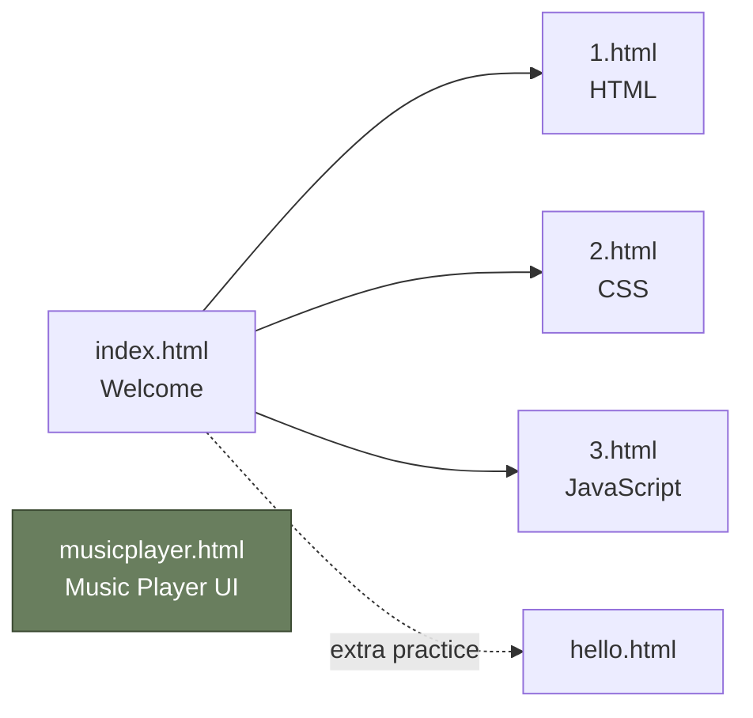

<div align="center">

English | [한국어](README.ko.md)

# HTML/CSS Intro Practice

**HTML/CSS Introductory Practice — WEB1 Tutorial Clone & Music Player UI**

<p>
  
  
  
  
</p>

A collection of static HTML/CSS pages built as a first step into web development.
Includes WEB1-style tutorial pages and a Flexbox-based music player UI exercise.


</div>

---

## Overview

This repository contains hands-on practice for **HTML and CSS fundamentals**, organized into two tracks:

1. **WEB1 Tutorial Clone** — Starting from `index.html`, a series of pages introducing HTML, CSS, and JavaScript through basic markup exercises.
2. **Music Player UI** — A static player interface in `musicplayer.html` using an external stylesheet (`style.css`), Font Awesome icons, and Flexbox layout.

> This is purely a markup/styling learning project. No backend logic or dynamic behavior is included.

---

## Pages

| File | Title | Topic | Notes |
| :--- | :--- | :--- | :--- |
| [`index.html`](index.html) | WEB1 - Welcome | Entry point, site intro | Navigation menu (HTML/CSS/JS) |
| [`1.html`](1.html) | WEB1 - HTML | HTML introduction | Basic tags, image embedding |
| [`2.html`](2.html) | WEB1 - CSS | CSS introduction | Internal `<style>`, `id`/`class` selectors |
| [`3.html`](3.html) | WEB1 - JavaScript | JavaScript introduction | Markup-only at this stage |
| [`hello.html`](hello.html) | WEB1 - html | HTML page copy | Additional practice |
| [`musicplayer.html`](musicplayer.html) | Music Player | Flexbox player UI | Uses `style.css` and Font Awesome |

---

## Running Locally

No build tools or dependencies are required. Serve the files with any static server:

```bash
# Clone the repository
git clone https://github.com/mrpc2003/html-css-intro-practice.git
cd html-css-intro-practice

# Start a local server (Python 3)
python3 -m http.server 8000
```

Then open in your browser:

```
http://localhost:8000/index.html
http://localhost:8000/musicplayer.html
```

> You can also double-click the HTML files directly, but a local server is recommended so that external fonts and icons load correctly.

---

## Page Navigation



The WEB1 tutorial pages are linked to each other via a shared top navigation menu.
`musicplayer.html` is a standalone single-page exercise.

---

## Learning Topics

<table>
<tr>
<td>

### HTML Basics
- Document structure (`<!DOCTYPE>`, `head`, `body`)
- Semantic tags (`<h1>`, `<p>`, `<ol>`, `<li>`, `<strong>`, `<u>`)
- Links and images (`<a href>`, ``)
- Korean encoding via `meta charset="utf-8"`

</td>
<td>

### CSS Basics
- Internal styles (`<style>`) vs external stylesheets (`<link>`)
- Selectors: `id`, `class`, element
- Color, alignment, `text-decoration`
- Google Fonts (`Roboto`) via `@import`

</td>
</tr>
<tr>
<td>

### Layout
- Flexbox (`display: flex`, `justify-content`, `align-items`)
- `box-sizing: border-box` reset
- Viewport meta for responsive design
- Progress bar pattern

</td>
<td>

### Component Practice
- Font Awesome icon buttons (play/pause/forward/backward)
- External link to a music page
- `class="hidden"` toggle pattern (prepared)
- Image centering and aspect ratio

</td>
</tr>
</table>

---

## Project Structure

```
html-css-intro-practice/
├── index.html          # Entry point (WEB1 - Welcome)
├── 1.html              # HTML introduction page
├── 2.html              # CSS introduction page (internal <style>)
├── 3.html              # JavaScript introduction page
├── hello.html          # Additional HTML practice
├── musicplayer.html    # Flexbox music player UI
├── style.css           # Stylesheet for the music player
├── coding.jpg          # Body image for WEB1 pages
├── 20251988.jpg        # Album art for the music player
└── README.md
```

---

## Notes

<details>
<summary>About the Music Player</summary>

- `musicplayer.html` focuses on **UI markup and styling practice**.
- Playback functionality (JavaScript) is not implemented at this stage — only a `script.js` reference placeholder exists.
- Clicking the album art (`20251988.jpg`) navigates to an external music page.

</details>

---

## Maintainer

**Kim Woohyun** ([@mrpc2003](https://github.com/mrpc2003))

---

<div align="center">
  <sub>A first HTML/CSS practice project — one page at a time.</sub>
</div>
